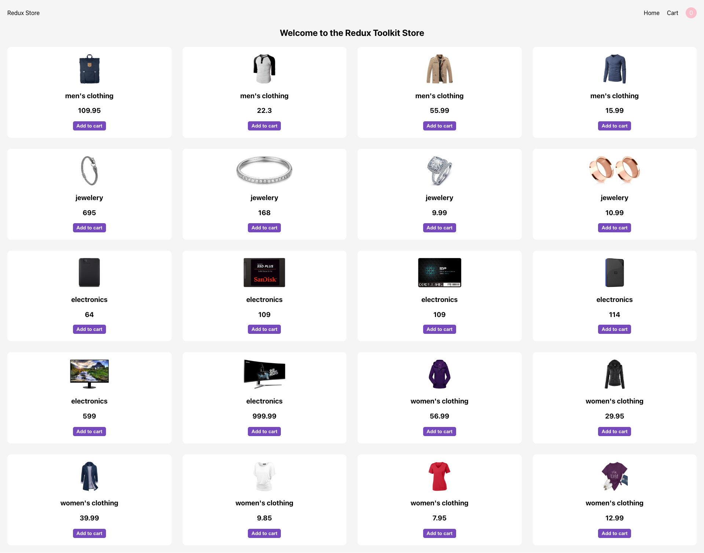

# Redux Toolkit Store

### Install Package
- react-router-dom@6
- npm install @reduxjs/toolkit
- npm install react-redux
- npm install redux-persist
- npm install redux-saga

## @reduxjs/toolkit

- configureStore
- createSlice
- createAsyncThunk

## <a href="https://shiv-redux-toolkit-store.netlify.app/"> LIVE DEMO</a>

  <b>Design Create by <a href="https://github.com/shivprajapat">Shiv Prajapat</a></b>

